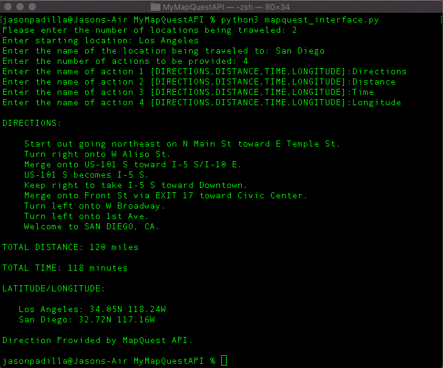

# MapQuestAPI
This program uses the MapQuest API to provide a user with instructions on how to get from one location to another. It starts by asking a user how many locations would they like to travel to, then the user enters the names of the locations. After that the user is asked what kind of information they would like such as the directions, the total time, the total distance or the longitude and latitude of each location.

# What I learned
  * How to interpet and manipulate JSON data
  * In-depth user error handling
  * String formatting

# How to run
  * Run "python3 mapquest_interface.py"
  * Choose a number of locations 2 or greater
  * Enter the name of locations
  * Enter what information to be displayed ["DIRECTIONS","DISTANCE","TIME","LONGITUDE"]
  
# Screenshots
  * Directions, Distance, Time and Longitude from Los Angeles, CA to San Diego, CA
  
  
  
